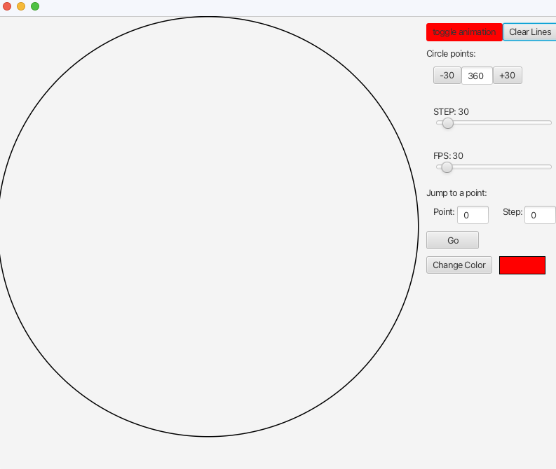
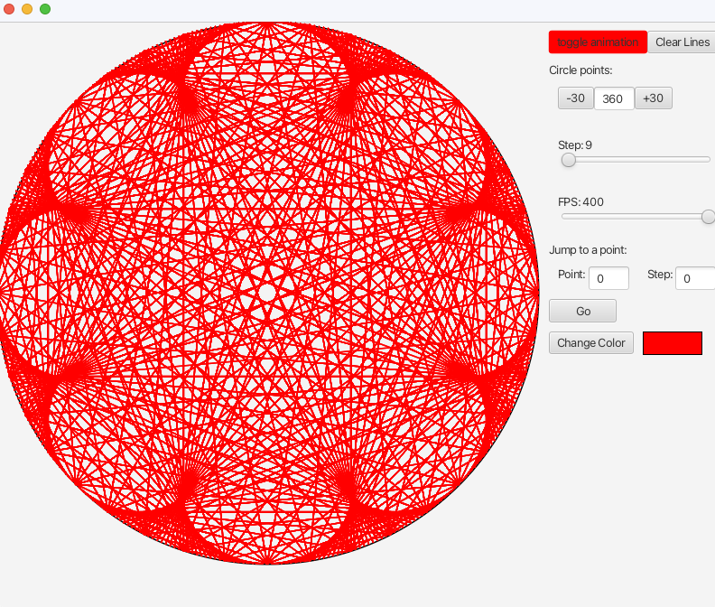
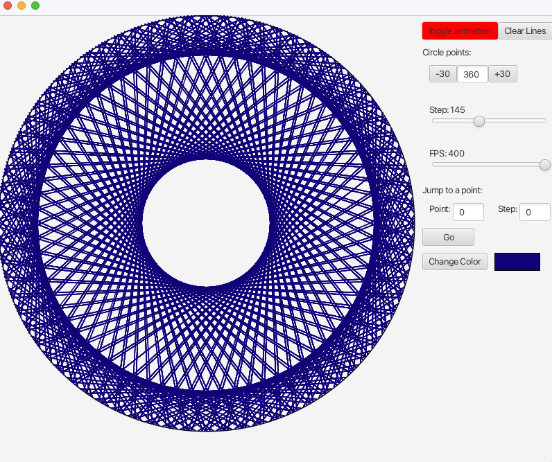
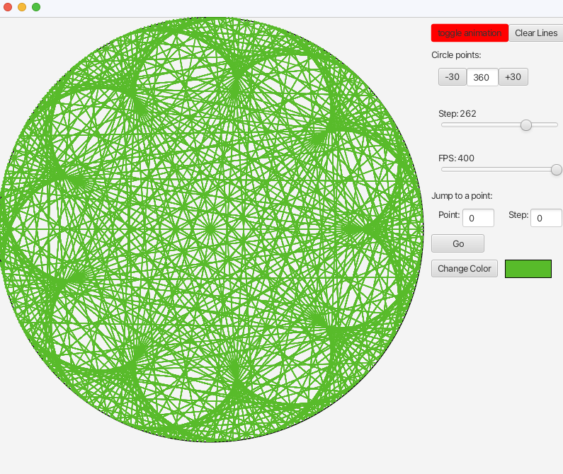
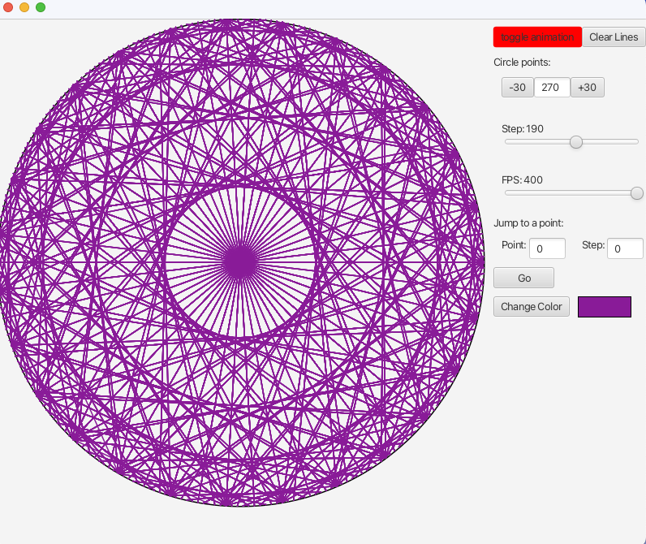

# CS 351 Program 1, Times Tables

Program based off of the video found [here.](https://www.youtube.com/watch?v=qhbuKbxJsk8&ab_channel=Mathologer)

## Requirements:
- Times tables of numbers up to 360
- up to 360 points around the circle 
- button to pause / play
- button to restart 
- ability to control increment size 
- ability to change how fast visualization runs 
- ability to jump to any given point 
- ability toswitch between at least 10 differnet colors while visualization plays

## Images:

